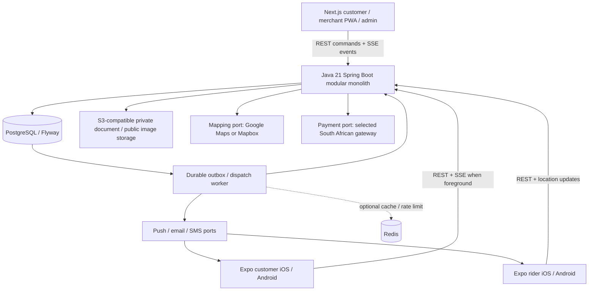
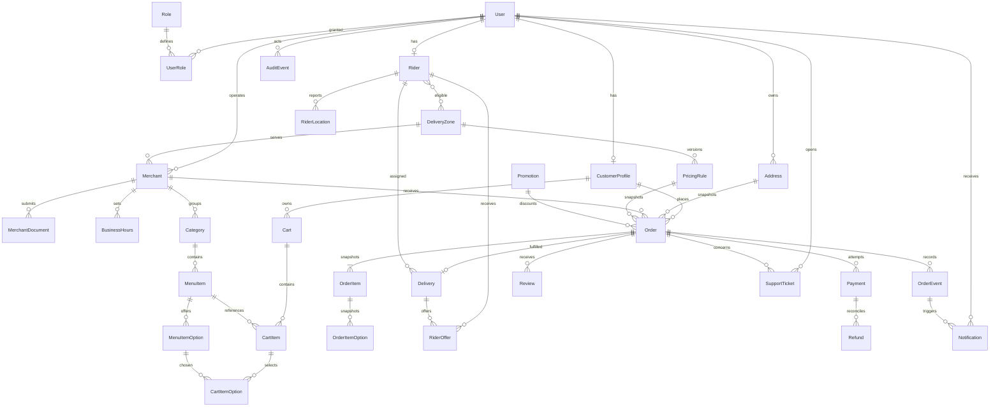
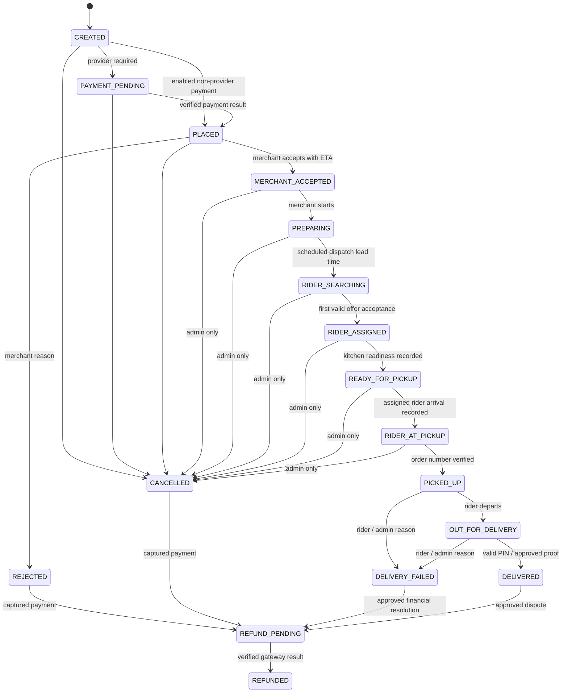

# Duze — pilot product and delivery blueprint

Status: proposed pilot design, 14 September 2026. Build increment 1: catalogue and order-domain foundation. This document specifies the destination; it does not claim all capabilities are implemented. See README for verified implementation status.

## 1. Assumptions and questions

Proceed with one merchant per basket, ZAR integer cents, Africa/Johannesburg business hours, email/password initially, customer PIN as default delivery proof, in-app support tickets, and a modular monolith. Sample merchants, location, prices and preparation times are fictional development data, not operational promises. Seed radius and fees must be reviewed before launch.

Decisions needed before the relevant integration: actual service boundary and merchant list; gateway and settlement account; commission/rider earnings and refund responsibility; rider operating arrangements; support staffing/hours; notification and map providers; identity verification process. None blocks catalogue development. Cash/manual payments are disabled unless an administrator explicitly enables them. Restricted products are disabled for the pilot. No multi-merchant checkout.

## 2. Product requirements document

**Outcome:** connect eXobho customers, 5–10 approved food/store merchants and a small motorcycle fleet through one reliable order record. Original Duze identity: “Local favourites. Delivered.”

**Customer:** account, verified contact, address pin plus landmark, serviceability check, browse/search, menu/modifiers, single-merchant basket, complete server quote, payment, status and eligible live rider location, notifications, history/reorder, review and support. Reorders revalidate prices and availability.

**Merchant:** approval, profile/menu/photos/options/hours/sold-out controls, visible and audible new-order inbox, accept/reject with reason, 15/20/30 minute preparation estimate, preparing/ready commands, history and basic sales metrics. Browser audio needs an explicit “Enable order alerts” action; push and inbox reconciliation cover missed notifications. No routine phone dispatch.

**Rider:** approval, explicit availability, fresh location/zone eligibility, expiring offers with pickup distance, delivery area, trip estimate and earning snapshot; accept/decline; navigation; arrival and order-number verification; pickup; route to customer; PIN or approved proof; restricted handoff refusal; earnings/history. Precise customer address appears only after assignment; customer sees rider location only during an active delivery.

**Admin:** approval/suspension, customer and order operations, versioned zone/fee/commission/earning configuration, assignment/reassignment, cancellation/refund/dispute workflows, promotions, support, reports and immutable audit history.

Pilot targets (to validate in staging): no duplicate charges or assignments; API p95 below 500 ms for ordinary reads at 50 concurrent clients; live status under 5 seconds when connected; alert on unacknowledged merchant orders after 2 minutes; alert when dispatch search exceeds 5 minutes. Measure acceptance time, rider wait, delivered/failed/cancelled rates, support volume and contribution per order. No invented customer ratings or delivery guarantees.

## 3. Journeys

| Actor | Happy journey | Recovery |
|---|---|---|
| Customer | Address → merchants → menu/options → basket → authoritative quote → payment → timeline → PIN handoff → review | Outside zone: explain; sold out/price change: reconfirm; payment timeout: retrieve same order; cancellation/refund: show separate financial progress |
| Merchant | Enable alerts → new-order modal with number/items/options/notes/totals → accept with ETA → preparing → ready → rider verifies collection | Reject with reason; reconnect reloads open orders; early readiness is recorded even without a rider; overdue orders notify admin |
| Rider | Approved → online → offer → accept → navigate → arrived → verify number → picked up → out for delivery → PIN → earnings | Expired/lost offer returns conflict; location stale pauses offers; invalid PIN is rate-limited; failed handoff opens support process |
| Admin | Monitor → resolve approval queues → configure zone/rules → inspect event timeline → intervene → reconcile | Reassignment revokes old access/offers atomically; no reassignment after pickup without supervised incident process; refunds reconcile provider results |

## 4. MVP versus future

MVP release includes all four roles, responsive customer/merchant/admin web, Expo customer/rider apps, one live payment gateway, refunds, basic deterministic dispatch, single active rider delivery, PIN, retriable notifications, audit trails, config editing, support, reviews, basic reports and approved ordinary goods. Customer mobile and rider mobile are separate deployable apps.

Future: multi-town routing, rider batching, scheduled orders, loyalty/wallet, subscriptions, advanced analytics, richer promotions, multilingual content after translation review, restricted categories after compliance approval. Increment 1 implements only public catalogue, local basket and order-domain rules; it cannot take payments or live orders.

## 5. Architecture



Modules: identity, catalogue, pricing, ordering, payments, dispatch, delivery, notification, support, administration. Database transactions are the correctness boundary; Redis does not decide assignment. Workers claim durable jobs with leases. Provider network calls run outside transactions and reconcile idempotently. Deploy API/worker from the same artifact, scaling separately later. Web proxies public reads to the API; secrets never reach browser bundles.

## 6. ERD



Target ERD includes later migrations; V1 is not the complete target schema. UUID PKs, FKs and timestamps on mutable entities; events are immutable with occurrence time and sequence. Index merchant/status, customer/date, offer/status/expiry, rider/location time, outbox/next attempt. Store order address, names, quantities, option prices, fees, discounts, commissions and earnings as snapshots. Unique customer/idempotency key plus request hash; unique provider event/reference and command keys. Partial unique active-delivery index per rider for pilot capacity of one; lock delivery AND rider records in consistent order. Restrict hard deletion of financial/order records. Add role junction, pricing versions and snapshot/options tables in their feature migrations.

## 7. Order state machine



REFUND is a financial workflow represented by REFUND_PENDING/REFUNDED, not a claim that money has moved. Failed refund retries remain pending, with attempt events and escalation. Only captured funds can be refunded, bounded by captured amount less prior refunds. Payment failure stays pending for a bounded retry period or cancels; late successful payment on a cancelled order triggers reconciliation/refund, never resurrects fulfilment.

Kitchen readiness and rider arrival can happen out of sequence in real life: store `kitchen_ready_at` and `rider_arrived_at` as orthogonal facts/events. Do not force a merchant to wait for assignment to report readiness. Once prerequisites hold, the command service advances canonical states in order, writing each event. The pure state machine checks graph and actor role; command services must additionally validate ownership, payment, ETA, assignment, snapshots and proof under transaction. SYSTEM means an internal trusted worker, never a role accepted from a client.

Customers cancel before merchant acceptance. Merchants reject PLACED only. Admin cancels before pickup with a reason; after pickup use delivery failure/incident handling. Terminal states cannot be reopened. Every accepted command stores OrderEvent, AuditEvent and notification outbox entry atomically. Duplicate command retries return the original result without another event.

## 8. Dispatch sequence

```mermaid
sequenceDiagram
  participant M as Merchant
  participant A as API
  participant D as PostgreSQL
  participant W as Dispatch worker
  participant R as Eligible rider
  participant N as Notification worker
  M->>A: Accept(order, prepMinutes, commandKey)
  A->>D: Lock order; accept; store ready ETA + due job + events
  A-->>M: Canonical state + version
  W->>D: Claim job at max(now, ETA - lead time)
  W->>D: Rank approved online zone riders with fresh location and capacity
  W->>D: Create expiring offer + earning snapshot + outbox
  N->>D: Claim outbox item
  N-->>R: Push offer ID (hint to fetch)
  R->>A: Accept(offer ID, command key)
  A->>D: Lock delivery and rider; recheck eligibility, expiry and capacity
  alt No winner and offer valid
    A->>D: Assign; revoke competing offers; write events; commit
    A-->>R: Assignment with pickup navigation
  else Expired / already assigned / unavailable
    A-->>R: 409 conflict; refresh offers
  end
  W->>D: Expiry: advance candidate; widen permitted radius
  W->>D: No candidate / search deadline: admin alert + durable retry
```

Initial policy: sequential 30-second offers, configurable 10-minute lead, location age ≤90 seconds and one active delivery per rider. These are configurable pilot hypotheses. Widen pickup search only within approved rider service zones; do not widen customer serviceability silently. Tie-break by distance then stable rider ID; workload becomes a score when capacity expands. Recheck eligibility during acceptance. Reassignment locks the same records, releases old rider, expires offers, increments assignment version and invalidates old rider access. Out-of-order jobs check current state/version before doing anything.

## 9. REST, live events and notification API plan

All `/api/v1`; UUID identifiers; RFC 9457 problem details; UTC ISO timestamps; integer ZAR cents; cursor pagination. Session identity derives actor/ownership. Mutations use Idempotency-Key where effects can duplicate; same key/different normalized payload →409. If-Match order/config version prevents stale updates. Validation →400/422; unauthenticated →401; unauthorized →403 or concealed 404; stale/invalid transition →409; rate limit →429.

| Domain | Commands and queries |
|---|---|
| Identity | POST auth/register, login, refresh, logout; GET me; CRUD customer/addresses |
| Public catalogue | GET merchants?query=&category=&zoneId=; GET merchants/{id}/menu (increment 1) |
| Basket/quote | GET/PUT customer/cart; POST customer/quotes using item/option IDs, quantity and address ID only |
| Orders | POST customer/orders with quote ID + idempotency key; GET customer/orders and /{id}; POST /{id}/cancel, reorder, reviews |
| Merchant | GET merchant/orders?status=; POST merchant/orders/{id}/accept {prepMinutes}, reject {reason}, preparing, ready; CRUD profile, menu, hours; GET analytics |
| Rider | PATCH rider/availability, location; GET offers; POST offers/{offerId}/accept, decline; GET deliveries/{id}; POST /arrived, pickup {orderNumber}, depart, complete {pin}, fail {reason}; GET earnings/history |
| Admin | GET overview/users/orders/merchants/riders; POST approvals/suspensions; CRUD zones, pricing, promotions; POST orders/{id}/assign, reassign, cancel, refunds; GET reports/audit; support ticket resolution |
| Providers | POST webhooks/payments/{provider}, verify raw-body signature and unique provider event ID; never trust browser redirect |

SSE: GET orders/{id}/events with authenticated participant authorization and Last-Event-ID replay; event `{id, type, orderId, version, occurredAt, data}`. Named events `order.updated`, `offer.created`, `offer.expired`, `delivery.location`, `notification.created`. Merchant inbox and rider offer streams are separately scoped. Reconnect replays durable order events or signals `resync` if retention expired; clients fetch authoritative snapshots and ignore older versions. Location updates are ephemeral, throttled and show “last updated”; never fabricate motion. Polling fallback when SSE is unavailable. WebSocket can replace high-frequency location transport later without changing command semantics.

Push contains minimal IDs, no sensitive address/PIN. Outbox delivers at least once with exponential backoff/jitter, unique delivery key, attempts, next-attempt time and dead-letter/admin escalation. Devices deduplicate notification IDs; opening fetches current state. Delivery receipts are not order transition evidence. Merchant sound/vibration requires platform permission; visible persistent inbox remains usable without it.

Provider ports: PaymentProvider.createIntent / verifyWebhook / fetchStatus / refund; MappingProvider.geocode / serviceable / routeEstimate; ObjectStorage.signedUpload / signedDownload; NotificationProvider.send. Sandbox and real credentials are separate; hosted gateway checkout avoids card handling in Duze.

## 10. Repository structure

```text
apps/web/                 Next.js App Router; customer, later merchant/admin routes
apps/mobile/customer/     planned Expo customer application
apps/mobile/rider/        planned Expo rider application
services/api/             Spring Boot modules and Flyway migrations
packages/contracts/       planned generated OpenAPI TypeScript client
packages/design-tokens/   planned shared web/native tokens
infra/compose/            local Postgres, Redis, API and web
.github/workflows/        automated verification
seed/exobho/              development-only deterministic seed
site/                     original static concept and source artwork
 docs/PROJECT_PLAN.md      this complete blueprint
 docs/api/                implemented OpenAPI contract
```

## 11. UI system and wireframes

Reference interpretation: deep green framing, cream canvas, orange primary actions, photographic food/local delivery imagery, rounded merchant cards, compact status chips. Use Duze's own layouts and typography. No competitor marks, invented ratings or alcohol promotions. Sample catalogue badges are explicit.

Tokens: forest #073C2F, green #125641, cream #FFF9EF, orange #FF781F, charcoal #18372D, muted #586B62, border #DFE6DD. Orange actions use dark text; white-on-orange small text is avoided. System sans font (no blocking font downloads); 4/8/12/16/24/32/48 spacing; 16–24px cards; ≥44px targets. Keyboard focus, semantic headings, visible labels, reduced-motion support, text alternatives and dialog focus restoration. Local responsive compressed imagery, lazy loading below fold, compact JSON, no auto-playing media. Target WCAG 2.2 AA, including 200% zoom, screen-reader and keyboard review before launch.

```text
Customer desktop
[ Duze / Local favourites ] [ eXobho pilot ]                  [ Basket (2) ]
[ Home • Restaurants • How it works ]
[ LOCAL FAVOURITES           | local delivery photograph                 ]
[ A little local.            |                                           ]
[ A lot to love.             |                                           ]
[ Search dishes or kitchens___________________ ] [ Browse kitchens ]
[ All kitchens ] [ Shisanyama ] [ Takeaways ] [ Stores ]
[ Neighbourhood favourites                         Sample catalogue ]
[ Photo / kitchen / prep ] [ Photo / kitchen / prep ] [ Photo / kitchen ]

Customer mobile
[ Duze                Basket ]
[ eXobho · pilot catalogue   ]
[ Hero + Browse kitchens    ]
[ Search___________________ ]
[ horizontal category chips ]
[ Merchant cards            ]
[ Home | Browse | Basket    ]

Menu → options → basket → checkout
[ Back / Kitchen / prep estimate ]
[ Item name / description / price / Add ]
[ Options: required group, max choices / note / quantity / Add ]
[ Basket lines / remove / subtotal / fees quoted at checkout ]
[ Address + landmark / subtotal / delivery / service / discount / total ]
[ Payment method / Confirm Rxxx ]

Tracking/history/profile
[ Status and last update / ETA range / accessible text timeline ]
[ Map when permitted / Rider / PIN private to customer / Support ]
[ Past orders / Reorder reprices ] [ Profile / Addresses / Preferences ]

Merchant tablet
[ Duze Business | Live orders | Menu | Hours | Analytics ]
[ Enable sound ] [ Connection status ]
[ NEW #1042 / items+modifiers+notes / totals / elapsed time ]
[ Reject + reason ] [ 15 / 20 / 30 min ] [ Accept ]
[ Preparing column ] [ Ready column ] [ Rider assignment / ETA ]

Rider phone
[ Duze Rider                    Online toggle ]
[ Offer expires 00:24 / pickup kitchen / pickup distance ]
[ Delivery area / trip km+minutes / You earn Rxx ]
[ Decline ] [ Accept ]
[ Navigate / Arrived / Verify # / Picked up / Start delivery ]
[ Customer handoff / PIN / Complete / Report problem ]
[ Earnings / completed deliveries ]

Admin desktop
[ Orders | Merchants | Riders | Zones & fees | Support | Reports ]
[ Today orders / fulfilment / unassigned / exceptions ]
[ Filterable orders / event drawer / assignment / reason-required action ]
[ Config version / effective time / fee preview / Save ]
```

Empty, loading, disconnected, error and denied states are required for each data screen. Never display a fake successful checkout, approval, payout or tracking map. Increment 1 basket explicitly stops before checkout.

## 12. Security and compliance release checklist

- [ ] Authentication, adaptive password hashing, rotating refresh tokens, secure HTTP-only web cookies, mobile secure storage; MFA for privileged users.
- [ ] RBAC plus tenant/ownership checks; suspension revokes sessions/offers; no client-provided actor role; CORS allowlist, CSRF protection for cookie mutations, rate limiting and request size limits.
- [ ] Server prices, quote expiry, stock/options validation, atomic order placement/idempotency, signed payment webhooks, bounded refunds, immutable snapshots and event/outbox transactions.
- [ ] Lock-based assignment integration race tests, proof attempt limits, hashed PIN, assignment-scoped address/location access, retention and audit redaction.
- [ ] Private S3 documents, signed expiring access, file type/size validation and malware scanning; no secrets or payment card data in logs.
- [ ] POPIA review: lawful processing purpose, minimal personal data, transparent notice, data subject access/correction process, retention/deletion schedule, operator agreements and breach response. Verify obligations with counsel before pilot. Source: [Protection of Personal Information Act](https://www.justice.gov.za/legislation/acts/2013-004.pdf).
- [ ] Restricted-category flag defaults off. Enable only after jurisdiction-specific licensing/legal review and approved merchants. Require 18+ confirmation and configurable ID check at handoff; age confirmation alone is insufficient. Rider refusal creates incident/return and financial-resolution events. Store verification outcome, not unnecessary ID images.
- [ ] Threat model, dependency/secret scan, TLS, least-privilege database users, managed secrets, restore-tested backups, staging isolation and incident/on-call runbook.

These are release gates, not a declaration of legal compliance. Platform implementation references: [Next.js docs](https://nextjs.org/docs), [Expo monorepos](https://docs.expo.dev/guides/monorepos/).

## 13. Acceptance criteria

| Area | Verifiable condition |
|---|---|
| Increment 1 catalogue | Approved merchants in active zones only; optional query/category/zone filter; suspended/unknown merchant menu returns 404; restricted items excluded; API outage has retry UI; desktop/mobile browsing and basket work |
| Pricing | Tampered client totals ignored; integer cents calculated from database and versioned rules; changed/sold-out options require a new quote; outside-zone address rejected |
| Idempotency | 20 concurrent identical placement/payment requests produce one business effect; different payload under same key returns 409 |
| Orders | Every legal edge and role tested; skipped/reversed/terminal transitions rejected; unauthorized tenant cannot mutate; every accepted mutation has event/audit/outbox in same commit |
| Merchant | Accept requires allowed ETA; alert contains complete snapshots; early-ready fact retained; reconnect restores unseen orders |
| Dispatch | Offline/suspended/stale/out-of-zone/full riders never win; 20 simultaneous offer accepts yield one winner; same rider cannot win two orders; expired offers fail; lead-time search precedes readiness; no-rider alert and reassignment tested |
| Delivery | Assigned rider verifies number; handoff requires valid rate-limited PIN or authorized proof; failures never mark delivered; revoked rider cannot access/update delivery |
| Notifications | Provider failure retries; duplicate and out-of-order messages do not regress client state; reconnection replays or resyncs |
| Admin | Configuration changes apply without deployment and preserve old order economics; reason/actor/version audited; partial refund cannot exceed remaining capture |
| Mobile/accessibility | Customer/rider Android and iOS device tests, foreground/background/offline behavior, denied permissions, keyboard/screen reader/zoom and slow network checks |
| Release | Fresh migrations + deterministic seed + CI pass; backup restored; live gateway reconciliation in staging; pilot operational rehearsal and approval |

## 14. Sprint plan

Each sprint ends with runnable code, tests, migrations where needed, Docker/README updates and a demo. Estimates are planning units, not delivery promises.

1. **Blueprint and browse foundation (current):** all 14 design sections, Next.js customer home/menu/basket, Spring Boot read API, corrected domain graph, SQL migration, OpenAPI, CI.
2. **Identity and catalogue operations:** auth/RBAC/ownership, merchant/rider approvals, menu/options/hours, uploads, admin basics, secure sessions.
3. **Quote and order:** address serviceability, configuration versions, authoritative quote, snapshots, idempotent placement, merchant alert inbox/ETA, transactional events/outbox.
4. **Payment:** sandbox provider port and chosen gateway, signed webhooks, payment retries, cancellation/refund reconciliation, no live activation until verified.
5. **Dispatch and rider:** due-job worker, ranking, leases/expiry, concurrency tests, manual reassignment, Expo rider availability/offer/pickup/PIN/earnings.
6. **Customer mobile and live tracking:** Expo catalogue/checkout/history/profile, push tokens and permissions, SSE recovery, mapping abstraction, location privacy.
7. **Operational completeness:** support/disputes, reviews/reorder, promotions/reports, analytics, merchant PWA resilience, config administration.
8. **Staging and pilot:** load/security/accessibility/device testing, CI/CD staging deployment with production approval gate, backup restoration, reconciliation, merchant/rider training and launch checklist.

Next slice begins only after assessing this increment's results. No production deployment, payments or app-store publication is implied by a local preview.
