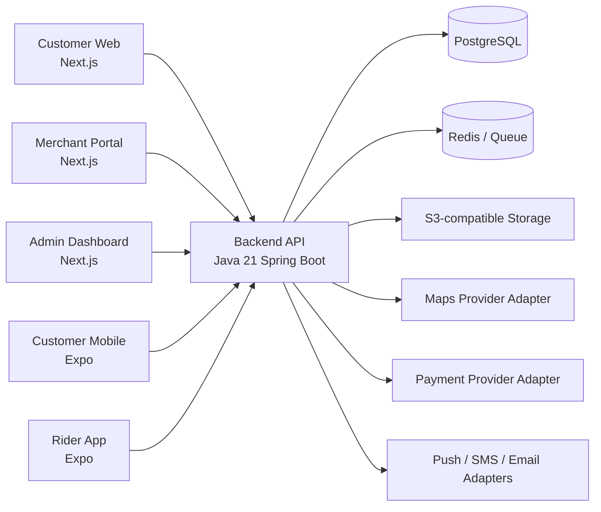
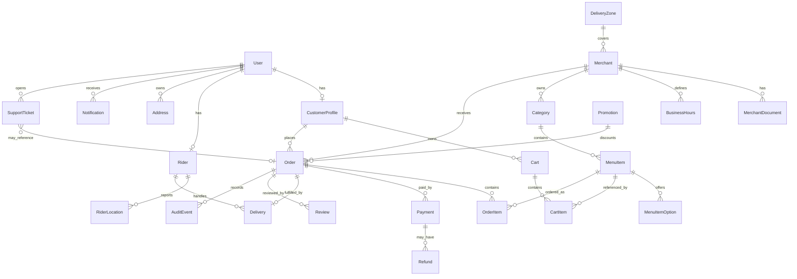

# Duze Project Plan

Duze is a local delivery marketplace for eXobho (Ixopo), KwaZulu-Natal, connecting customers, local merchants, motorcycle riders and platform admins.

Tagline: **Local favourites. Delivered.**

## 1. Assumptions And Open Questions

### Assumptions

- Launch starts in a configurable central eXobho delivery zone with 5-10 merchants and a small rider fleet.
- MVP supports prepared food, shisanyama, takeaways and approved non-restricted store products.
- Alcohol and other age-restricted items stay disabled until legal review, merchant licensing checks and operational controls are ready.
- One backend API serves customer web, customer mobile, merchant dashboard, rider app and admin dashboard.
- Payment architecture must support South African providers, but the MVP can include a provider abstraction and admin-enabled manual/cash mode.
- Maps, routing, notifications, object storage and payments are integrated behind provider interfaces.
- Admin users can change zones, fees, commissions, merchant approval and rider approval without code changes.
- The first implementation should prioritize reliable order state, dispatch integrity and operational visibility over advanced marketplace automation.

### Questions That Affect The Build

- Which payment gateway should be prioritized first for South Africa?
- Should phone OTP be mandatory at launch, or can email/password plus phone verification follow?
- Will riders be employees, contractors or merchant-provided drivers?
- What proof of delivery is preferred for MVP: PIN, photo, signature or admin-configurable options?
- What exact central eXobho service boundary should define the first delivery zone?
- Should customers be allowed to order from multiple merchants in one checkout, or one merchant per order for MVP?
- What commission, delivery-fee and payout rules should be used for pilot merchants?
- Which operational support channel should be available first: in-app tickets, WhatsApp handoff, phone, or email?

## 2. Product Requirements Document

### Goal

Build a production-ready MVP that allows customers to browse approved local businesses, place delivery orders, track status, and receive orders delivered by approved riders while merchants and admins manage operations.

### Primary Users

- Customer: browses, orders, pays and tracks delivery.
- Merchant: manages menu and handles incoming orders.
- Rider: accepts delivery jobs and completes handoff.
- Admin: approves participants, configures operations and resolves issues.

### MVP Outcomes

- Customers can place valid orders within supported delivery zones.
- Merchants can accept or reject incoming orders and update preparation status.
- Admins can assign or reassign riders and inspect order history.
- Riders can go online, accept jobs, confirm pickup and confirm delivery.
- Order state transitions are strict, auditable and visible.
- Zones and fees are configurable without code changes.

### Non-Goals For MVP

- Multi-town expansion.
- Advanced rider batching.
- Alcohol enablement.
- Merchant ads and promoted listings.
- Full loyalty system.
- Complex subscription tooling.

## 3. User Roles And Journeys

### Customer Journey

1. Sign up or log in.
2. Add or select delivery address.
3. Browse categories and merchants available for that address.
4. View menu and item options.
5. Add items to cart.
6. Review fees, address, contact details and payment method.
7. Place order.
8. Track order timeline from placed to delivered.
9. Rate order and request support if needed.

### Merchant Journey

1. Merchant applies or is invited.
2. Admin verifies and approves merchant.
3. Merchant configures profile, hours, categories and menu items.
4. Merchant receives live incoming order.
5. Merchant accepts/rejects and sets estimated preparation time.
6. Merchant marks order ready for pickup.
7. Merchant reviews completed orders and basic analytics.

### Rider Journey

1. Rider signs up and submits onboarding details.
2. Admin approves rider.
3. Rider goes online.
4. Rider receives delivery offer.
5. Rider accepts job.
6. Rider navigates to merchant and confirms pickup.
7. Rider navigates to customer and confirms delivery with proof.
8. Rider views earnings and delivery history.

### Admin Journey

1. Admin reviews platform KPIs.
2. Admin approves merchants and riders.
3. Admin configures zones, fees, commissions and promotions.
4. Admin monitors active orders.
5. Admin manually reassigns riders when needed.
6. Admin handles refunds, disputes and support tickets.
7. Admin reviews reports and audit events.

## 4. MVP Vs Future Scope

### MVP

- Authentication and role-based access.
- Customer browsing, cart, checkout and tracking.
- Merchant onboarding, profile, hours and menu management.
- Merchant live order workflow.
- Rider online status, job offers, pickup and delivery confirmation.
- Admin users, merchants, riders, orders, zones, fees and reports.
- Configurable delivery zones and fee rules.
- Strict order state machine.
- Seed data for eXobho pilot.
- Dockerized local development.
- Tests for critical API and state-machine behavior.

### Future

- Scheduled orders.
- Loyalty and wallet.
- Smart dispatch and batching.
- Merchant ads and promoted placement.
- Multi-town marketplace operations.
- Advanced merchant analytics.
- Public business APIs.
- Age-restricted item workflows after legal readiness.
- Staff permissions inside merchant accounts.

## 5. System Architecture Diagram



## 6. Database ERD



Core tables use UUID primary keys, `created_at`, `updated_at`, foreign keys, indexes on lookup fields, and optimistic locking where concurrent order/rider updates matter.

## 7. API Endpoint Plan

Base path: `/api/v1`

### Auth

- `POST /auth/register`
- `POST /auth/login`
- `POST /auth/refresh`
- `POST /auth/logout`
- `GET /me`

### Customer

- `GET /customer/home`
- `GET /customer/merchants`
- `GET /customer/merchants/{merchantId}`
- `GET /customer/search`
- `GET /customer/cart`
- `POST /customer/cart/items`
- `PATCH /customer/cart/items/{itemId}`
- `DELETE /customer/cart/items/{itemId}`
- `POST /customer/orders`
- `GET /customer/orders`
- `GET /customer/orders/{orderId}`
- `POST /customer/orders/{orderId}/reviews`
- `POST /customer/support-tickets`

### Merchant

- `GET /merchant/profile`
- `PATCH /merchant/profile`
- `GET /merchant/menu/categories`
- `POST /merchant/menu/categories`
- `POST /merchant/menu/items`
- `PATCH /merchant/menu/items/{itemId}`
- `PATCH /merchant/menu/items/{itemId}/availability`
- `GET /merchant/orders/live`
- `POST /merchant/orders/{orderId}/accept`
- `POST /merchant/orders/{orderId}/reject`
- `POST /merchant/orders/{orderId}/ready`
- `GET /merchant/analytics/summary`

### Rider

- `PATCH /rider/availability`
- `PATCH /rider/location`
- `GET /rider/offers`
- `POST /rider/offers/{deliveryId}/accept`
- `POST /rider/offers/{deliveryId}/decline`
- `POST /rider/deliveries/{deliveryId}/pickup`
- `POST /rider/deliveries/{deliveryId}/complete`
- `GET /rider/earnings`

### Admin

- `GET /admin/overview`
- `GET /admin/users`
- `GET /admin/merchants`
- `POST /admin/merchants/{merchantId}/approve`
- `POST /admin/merchants/{merchantId}/suspend`
- `GET /admin/riders`
- `POST /admin/riders/{riderId}/approve`
- `POST /admin/riders/{riderId}/suspend`
- `GET /admin/orders`
- `POST /admin/orders/{orderId}/assign-rider`
- `POST /admin/orders/{orderId}/cancel`
- `GET /admin/zones`
- `POST /admin/zones`
- `PATCH /admin/zones/{zoneId}`
- `GET /admin/fees`
- `PATCH /admin/fees`
- `GET /admin/audit-events`
- `GET /admin/reports/orders`

## 8. Folder And Repository Structure

```text
duze/
  apps/
    web/
      customer/
      merchant/
      admin/
    mobile/
      customer/
      rider/
  services/
    api/
      src/main/java/
      src/main/resources/db/migration/
      src/test/java/
  packages/
    ui/
    config/
    types/
  infra/
    docker/
    compose/
    ci/
  docs/
    PROJECT_PLAN.md
    api/
    architecture/
  seed/
    exobho/
```

Initial implementation can use a monorepo with separate deployable apps and one Spring Boot API.

## 9. UI Design System And Wireframes

### Design Tokens

- Background: warm cream `#FFF7EA`
- Surface: soft white `#FFFFFF`
- Primary: fresh green `#0F7A4A`
- Primary dark: deep green `#075236`
- Accent: warm orange `#F97316`
- Text: deep charcoal `#20231F`
- Muted text: `#6B6F68`
- Border: `#E8DDCC`
- Radius: 8px for cards and controls
- Typography: mobile-first, high contrast, no negative letter spacing

### Customer Home

```text
+------------------------------------------------+
| Location: eXobho Central                 Cart  |
| [Search local food, shisanyama, stores...]     |
| Food | Shisanyama | Stores | Specials          |
| Featured near you                              |
| [Merchant image] Marley's Shisanyama 25-35 min |
| [Merchant image] Town Grill         20-30 min   |
+------------------------------------------------+
```

### Merchant Page

```text
+------------------------------------------------+
| [Food photo hero]                              |
| Marley's Shisanyama   Open   25-35 min         |
| Grill Plates | Wings | Sides | Drinks          |
| [Item photo] Grill Plate      R89   [+]         |
| [Item photo] Wings Combo      R75   [+]         |
+------------------------------------------------+
```

### Tracking

```text
+------------------------------------------------+
| [Map / route area]                              |
| Order status: Rider is on the way               |
| Placed -> Accepted -> Preparing -> Picked up    |
| Rider details when assigned                     |
| [Contact support]                              |
+------------------------------------------------+
```

### Merchant Live Orders

```text
+------------------------------------------------+
| Live Orders                  New 3 Preparing 2  |
| #1042  Marley's  R184  2 items                  |
| [Accept 25 min] [Reject]                        |
| Preparing                                      |
| #1040  Mark ready                              |
+------------------------------------------------+
```

### Rider App

```text
+------------------------------------------------+
| Online toggle                                  |
| New offer                                      |
| Pickup: Marley's Shisanyama                    |
| Drop-off: eXobho Central                       |
| Distance: 3.2 km  Est. earning: R32            |
| [Accept] [Decline]                             |
+------------------------------------------------+
```

### Admin Dashboard

```text
+------------------------------------------------+
| KPIs: Orders | GMV | Avg delivery | Cancels     |
| Active orders table                             |
| Merchant approvals                              |
| Rider approvals                                 |
| Zone and fee controls                           |
+------------------------------------------------+
```

## 10. Security And Compliance Checklist

- Use server-side validation for all commands and DTOs.
- Hash passwords with a modern adaptive algorithm.
- Use short-lived access tokens and refresh-token rotation or secure sessions.
- Enforce RBAC on every route.
- Rate-limit auth, checkout and state-changing endpoints.
- Use idempotency keys for order creation and payment operations.
- Store secrets outside source control.
- Avoid logging secrets, tokens, full card data or unnecessary personal data.
- Keep audit events for approval, order state changes, refunds, dispatch and admin actions.
- Validate zone eligibility server-side.
- Use optimistic or pessimistic locking for rider assignment and order transitions.
- Keep age-restricted product configuration disabled until compliance is approved.
- Support age verification and refusal workflow before enabling restricted categories.
- Document POPIA privacy obligations before launch.
- Run dependency scanning and OWASP checks in CI.

## 11. Sprint-By-Sprint Implementation Plan

### Sprint 1: Product Foundation

- Confirm pilot zone, fees, merchant list and user journeys.
- Create wireframes and design tokens.
- Initialize monorepo, formatting, linting and Docker Compose.

### Sprint 2: Backend Foundation

- Spring Boot API, PostgreSQL, migrations, auth and RBAC.
- Core user, merchant, rider and audit tables.
- Seed pilot data.

### Sprint 3: Merchant And Menu

- Merchant profile, hours, categories and menu CRUD.
- Image placeholder/storage abstraction.
- Merchant approval flow.

### Sprint 4: Customer Browse And Cart

- Customer web home, merchant list, merchant detail and cart.
- Address and zone eligibility checks.
- Fee preview.

### Sprint 5: Checkout And Merchant Orders

- Order creation, state machine and idempotency.
- Merchant live orders, accept/reject and prep status.
- Order timeline API.

### Sprint 6: Rider And Dispatch

- Rider availability and location.
- Dispatch assignment rules.
- Rider offer, pickup and delivery confirmation.
- Admin reassignment.

### Sprint 7: Tracking, Notifications And Admin Ops

- Customer tracking map/status.
- Notification adapter.
- Admin overview, order management, zones and fees.

### Sprint 8: Payments, QA And Pilot Readiness

- Payment abstraction and selected gateway/manual mode.
- Refund flow.
- Security review, integration tests and pilot runbook.

## 12. Acceptance Criteria

### Authentication And Roles

- Users can register, log in, refresh sessions and log out.
- Protected endpoints reject unauthenticated requests.
- Role-specific endpoints reject users without the required role.

### Merchant Management

- Admin can approve and suspend merchants.
- Approved merchants can edit profile, hours and menu.
- Customers only see approved, active merchants available in their zone.

### Cart And Checkout

- Customers can add valid available items from one merchant.
- Cart totals include item subtotal, delivery fee, service fee and discounts.
- Checkout fails when address is outside the delivery zone.
- Duplicate checkout submissions do not create duplicate orders.

### Order State Machine

- Only valid state transitions are accepted.
- Every state change creates an audit event.
- Cancellation rules are enforced based on state and actor.

### Merchant Orders

- Merchant can accept, reject and mark orders ready.
- Merchant cannot update orders belonging to another merchant.
- Customer timeline reflects merchant changes.

### Dispatch And Rider

- Only approved online riders can receive offers.
- One active delivery cannot be assigned to multiple riders.
- Rider can confirm pickup only after assignment.
- Rider can complete delivery only after pickup.

### Admin Operations

- Admin can configure zones and fee rules.
- Admin can manually assign or reassign riders.
- Admin can view order history and audit events.

### Payments

- Payment operations use provider abstraction.
- Payment and refund status changes are auditable.
- Manual/cash payment is only available when enabled by admin.

### Reliability And Delivery

- Local development starts with Docker Compose.
- Database migrations run from a clean database.
- Critical backend tests pass in CI.
- README explains setup, run, seed and test commands.
